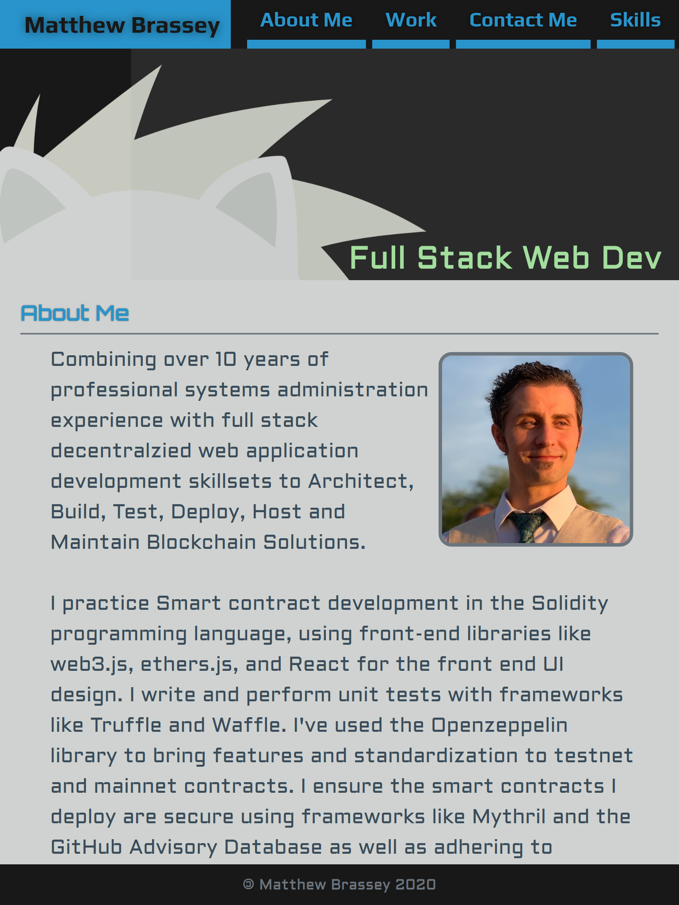

# Portfolio

> Responsive portfolio concept written mostly in HTML/CSS.

- [x] [Responsive Flexbox Layout](https://github.com/MBrassey/ResponsivePortfolio/issues/1)
- [x] [Portfolio Grid CSS](https://github.com/MBrassey/ResponsivePortfolio/issues/2)
- [x] [3 Viewport Ranges - Media Queries](https://github.com/MBrassey/ResponsivePortfolio/issues/3)
- [x] [CSS Enhancements & Optimizations](https://github.com/MBrassey/ResponsivePortfolio/issues/4) 
- [x] [Addition of Personal Content & Resources](https://github.com/MBrassey/ResponsivePortfolio/issues/5)
- [x] [Custom Fonts](https://github.com/MBrassey/ResponsivePortfolio/issues/11)
- [x] [Final TouchUps](https://github.com/MBrassey/ResponsivePortfolio/issues/20)
- [x] [Re-Factor CSS & Add LICENSE](https://github.com/MBrassey/ResponsivePortfolio/issues/26)
<h6>
[ Click the below image to view the <a href="https://MBrassey.github.io/ResponsivePortfolio/">webapplication</a> ]
</h6>

[
](https://MBrassey.github.io/ResponsivePortfolio/)